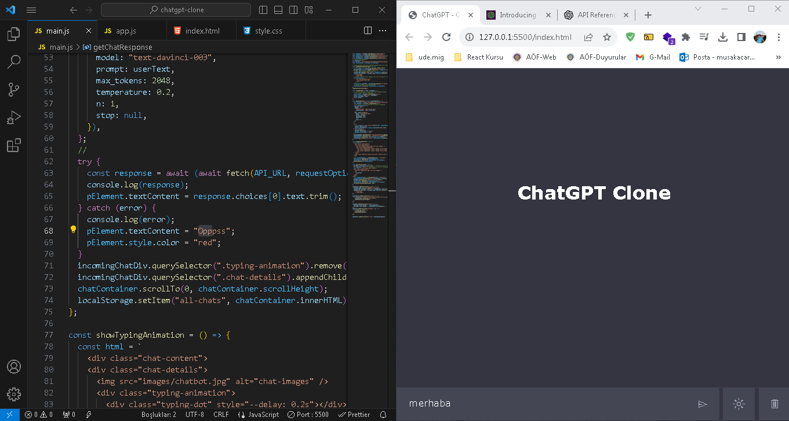

<h2>Chatgpt Clone Project</h2>

ChatGBT Clone is a project that replicates the functionalities of ChatGBT using the provided API_KEY. It allows users to send fetch requests to the system, enabling the interpretation of questions in multiple languages and providing responses accordingly. The project is built using HTML5, CSS, and advanced JavaScript.

<h3>Dark and Light Mode<h3>
The project offers both dark and light mode options for user preference. You can easily toggle between modes using the provided settings.

<h3>Technologies used in project construction</h3>

- HTML
- CSS
- Javascript
- APİ_KEY

<h3>Screenshot</h3>

